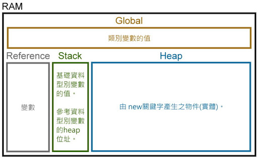
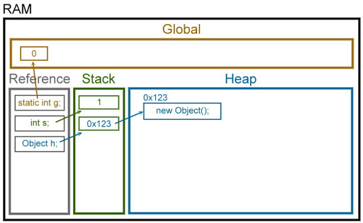

## Java == 及 equals 的差別

首先我們先了解一下 Java 宣告參數及物件在記憶體的配置。




宣告為基本型態的參數可以直接用 `==` 來判斷是否相等 ; 而參考型態則有不同的判斷方式。 

基本型態的比較 [live demo](http://tpcg.io/3l2d6v)：
```markdown
public class ComparisonDemo1 {
	public static void main(String[] args) {
		//基本型態的比較
		byte 	b1=1, b2=1;
		short 	s1=2, s2=2;
		int 	i1=3, i2=3;
		long 	l1=4, l2=4;
		float 	f1=5.1f, f2=5.1f;
		double 	d1=6.2, d2=6.20;
	}
}
```

>b1==b2: true
>s1==s2: true
>i1==i2: true
>l1==l2: true
>f1==f2: true
>d1==d2: true

參考型態的比較 [live demo](http://tpcg.io/w50qrI)：
```
public class ComparisonDemo2 {

	public static void main(String[] args) {
		//參考型態的比較
		Byte B1 = new Byte((byte)100), B2 = new Byte((byte)100);
		Short S1 = new Short((short)300), S2 = new Short((short)300);
		Integer I1 = new Integer(100), I2 = new Integer(100);
		Long L1 = new Long(1000), L2 = new Long(1000);
		Float F1 = new Float(100.12), F2 = new Float(100.120);
		Double D1 = new Double(100.0123), D2 = new Double(100.012300);
		BigDecimal BD1 = new BigDecimal(123.010), BD2 = new BigDecimal(123.0100);
	}

}
```

### Markdown

Markdown is a lightweight and easy-to-use syntax for styling your writing. It includes conventions for

```markdown
Syntax highlighted code block

# Header 1
## Header 2
### Header 3

- Bulleted
- List

1. Numbered
2. List

**Bold** and _Italic_ and `Code` text

[Link](url) and 
```

For more details see [GitHub Flavored Markdown](https://guides.github.com/features/mastering-markdown/).

### Jekyll Themes

Your Pages site will use the layout and styles from the Jekyll theme you have selected in your [repository settings](https://github.com/ivan11182002/rc-sharing/settings). The name of this theme is saved in the Jekyll `_config.yml` configuration file.

### Support or Contact

Having trouble with Pages? Check out our [documentation](https://help.github.com/categories/github-pages-basics/) or [contact support](https://github.com/contact) and we’ll help you sort it out.
