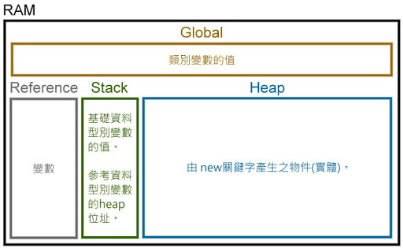
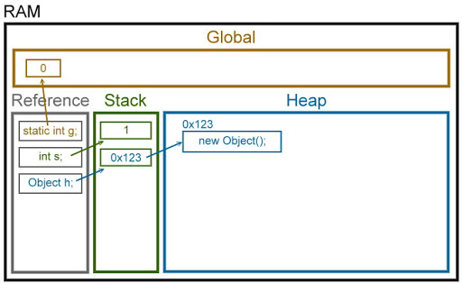
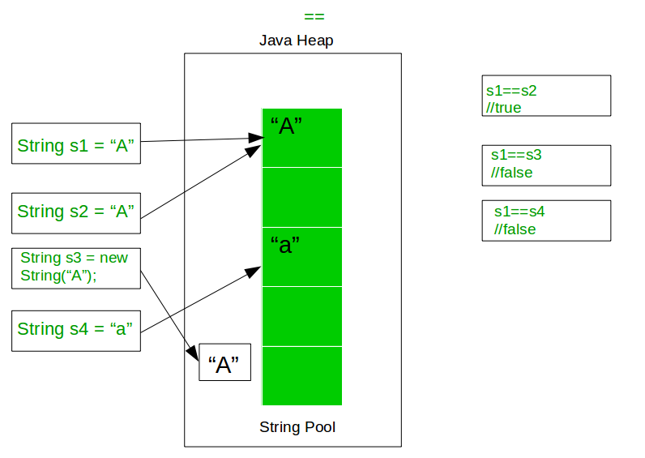

## Java CompareTo, Comparator

首先我們先了解一下 Java 宣告參數及物件在記憶體的配置。




宣告為基本型態的參數可以直接用 `==` 來判斷是否相等 ; 而參考型態則有不同的判斷方式。 

**基本型態的比較 [live demo](http://tpcg.io/3l2d6v)：**
```java
public class ComparisonDemo1 {
	public static void main(String[] args) {
		//基本型態的比較
		byte 	b1 = 1,      b2 = 1;
		short 	s1 = 2,      s2 = 2;
		int 	i1 = 3,      i2 = 3;
		long 	l1 = 4,      l2 = 4;
		float 	f1 = 5.1f,   f2 = 5.1f;
		double 	d1 = 6.2,    d2 = 6.20;
	}
}
```

比較結果
> true,   true,   true,   true,   true,   true

**參考型態的比較 [live demo](http://tpcg.io/w50qrI)：**
```java
public class ComparisonDemo2 {
	public static void main(String[] args) {
		//參考型態的比較
		Byte B1 = new Byte((byte)100),            B2 = new Byte((byte)100);
		Short S1 = new Short((short)300),         S2 = new Short((short)300);
		Integer I1 = new Integer(100),            I2 = new Integer(100);
		Long L1 = new Long(1000),                 L2 = new Long(1000);
		Float F1 = new Float(100.12),             F2 = new Float(100.120);
		Double D1 = new Double(100.0123),         D2 = new Double(100.012300);
		BigDecimal BD1 = new BigDecimal(123.010), BD2 = new BigDecimal(123.0100);
	}

}
```

比較結果
```
Byte               B1==B2: false
Short              S1==S2: false
Integer            I1==I2: false
Long               L1==L2: false
Float              F1==F2: false
Double             D1==D2: false
BigDecimal       BD1==BD2: false

Byte         B1.equals(B2): true
Short        S1.equals(S2): true
Integer      I1.equals(I2): true
Long         L1.equals(L2): true
Float        F1.equals(F2): true
Double       D1.equals(D2): true
BigDecimal BD1.equals(BD2): true
```

> 由結果得知，`==` 比較的是兩者是否是同一個物件 ; 而 `equals` 才是比較內容值。然而就像大部分的則規一樣，都有例外…

**例外情況：**
```java
public class ComparisonDemo3 {
	public static void main(String[] args) {		
		
		Integer I1=127,   I2=127;
		Integer I3=300, I4=300;
		System.out.println("I1==I2: " + String.valueOf(I1==I2));
		System.out.println("I3==I4: " + String.valueOf(I3==I4) + "\n");
		
		String newString1 = new String("Oracle");
		String newString2 = new String("Oracle");
		System.out.println("newString1==newString2       : " + String.valueOf(newString1==newString2)) ;
		System.out.println("newString1.equals(newString2): " + String.valueOf(newString1.equals(newString2)) + "\n");
		
		String javaStr3="Java";
		String javaStr4="Java";
		System.out.println("javaStr3==javaStr4: " + String.valueOf(javaStr3==javaStr4));
	}
}
```

> 比較結果讓大家猜一猜：[看解答](http://tpcg.io/OsaZ6W)

為何 I1 等於等於 I2 而 I3 不等於等於 I4 呢? 因為 `Integer` 有個叫 `IntegerCache` 的內部類別，可以保證 -127~127 是相等的(但要是 new 出物件就還是不相等)。

同樣的，`Short`、`Long` 也有他們的 Cache 類別。

> 清醒一下：那為什麼 `Byte` 沒有 ?

javaStr3==javaStr4 的原因是為了節省系統的資源，對於一些可共享的`String` 物件會先去 String Pool 查找是否有相同的 `String` 內容值，若有找到就直接回傳，不再重新 new 一個新的物件，參考下圖。

當然，如果你直接 new 出來，那就不囉嗦，直接是一個新的物件。




**Calendar比較 [live demo](http://tpcg.io/enYwqH)：**
```java
public class ComparisonDemo4 {
	public static void main(String[] args) {
		Calendar C1=Calendar.getInstance();
		C1.set(2019, 2, 3);
		Calendar C2=Calendar.getInstance();
		C2.set(2019, 2, 3);
		
		System.out.println("C1==C2               : " + String.valueOf(C1==C2));
		System.out.println("C1.equals(C2)        : " + String.valueOf(C1.equals(C2)));
		System.out.format("C1,C2 timeMiliiseconds: %d, %d \n",C1.getTimeInMillis() , C2.getTimeInMillis());
		
		C2=(Calendar) C1.clone();
		System.out.println("C1.equals(C2) clone  : " + String.valueOf(C1.equals(C2)));		
	}
}
```

比較結果：
```java
C1==C2               : false
C1.equals(C2)        : false
C1,C2 timeMiliiseconds: 1551590675463, 1551590675476 
C1.equals(C2) clone  : true

```

> 不equals 的原因很簡單，因為時間不一樣

大致了解基本型態與參考型態的比較後，接下來我們來自訂類別，再比較看看。[live demo](http://tpcg.io/y6Iqdz)

**先創建 Point1 類別**
```java
class Point1 {
	int x=0;
	int y=0;
	Point1(int x, int y){
		this.x = x;
		this.y = y;
	}
}
```

**Main class ComparisonDemo5**
```java
public class ComparisonDemo5 {
	public static void main(String[] args) {
		Point1 p11 = new Point1(1,1);
		Point1 p12 = new Point1(1,1);		
		System.out.println("p11.equals(p12): " + String.valueOf(p11.equals(p12)));		
	}
}
```

> 結果會如何呢? 答案是 `false`

任何物件都繼承自 `Object`，若沒有 @Override(覆寫) `equals` 方法時，就會調用 `Object` 的 `equals` 方法，也就是 `==`：
```java
public class Object {
	...
	public boolean equals(Object obj) {
        return (this == obj);
    }
    ...
}
``` 

**將 Point1 稍作修改**
```java
class Point1 {
	int x=0;
	int y=0;
	Point1(int x, int y){
		this.x = x;
		this.y = y;
	}
	@Override
	public boolean equals(Object that) {
		if(that==null) {
			return false;
		}
		if(that instanceof Point1) {
			return this.x == ((Point2)that).x && this.y == ((Point2)that).y;
		}
		return false;
	}
}
```

> 再執行一次，結果應該就會是 `true` 了

接著進一步將 **Point1** 物件放入 Collection 裡，再判斷物件的內容值是否相等。[live demo](http://tpcg.io/ZY335Q)
```java
public class ComparisonDemo52 {
	public static void main(String[] args) {
		Point1 p11 = new Point1(1,1);
		Point1 p12 = new Point1(1,1);
		HashSet<Point1> set = new HashSet<Point1>();
		set.add(p11);
		System.out.println("is p12 contains in set: " + String.valueOf(set.contains(p12)));		
	}
}
```

> 執行結果是 `false`

如果牽扯到 `Collection`，那就要考慮到 `hashCode` 了。

當`Collection`物件放入(put) 某個元素(物件)時，會先調用 `hashCode()` 方法，決定這個物件要存在哪個位置。若該位置沒有其他物件就直接儲存; 否則會調用 `equals()` 判斷是否為相同元素，相同元素不存; 不相同則散列於其他位置。

**重新創建一個類別 Point2**
```java
class Point2 {	
	int x=0;
	int y=0;
	int identifier=0;
	Point2(int x, int y, int h){
		this.x = x;
		this.y = y;
		this.identifier = h;
	}
	@Override
	public boolean equals(Object that) {
		if(that==null) {
			return false;
		}
		if(that instanceof Point2) {
			return this.x == ((Point2)that).x && this.y == ((Point2)that).y;
		}
		return false;
	}
	/*----------------------------------------*/
	@Override
	public int hashCode() {
		return this.identifier * 123;
	}
	/*----------------------------------------*/
	
}
```

**ComparisonDemo52**
```java
public class ComparisonDemo52 {
	public static void main(String[] args) {		
		Point2 p21 = new Point2(3,3, 9);
		Point2 p22 = new Point2(3,3, 9);
		HashSet<Point2> set2 = new HashSet<Point2>();
		set2.add(p21);
		System.out.println("is p22 contains in set: " + String.valueOf(set2.contains(p22)));
		
	}

}
```

> 最後，它終於相等了(灑花)
